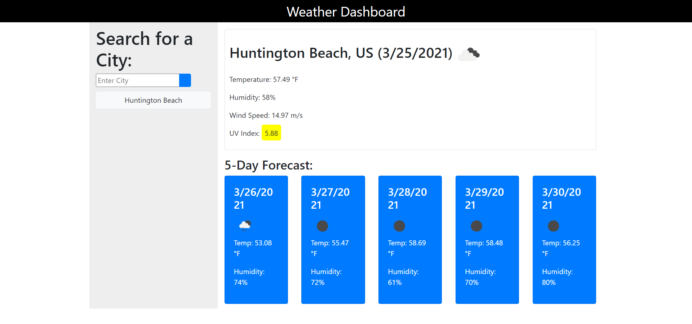

# 06-Your-Weather-Dashboard
- Sixth Assignment

## HTML, Javascript, CSS
- I created a weather dashboard application for searching the weather in major cities across the US
- User will input the city of which they wish to see the weather and the current temperature will be displayed along with an icon 
  representing weather conditions, the humidity, the wind speed, and the UV index
- A 5 day forecast will also display below the current weather index, along with the same information as stated above for each day
- Users city searches will be saved to local storage and display in a list below the search box

### Link to deployed application
<a href= "https://lyndseyfin.github.io/06-Your-Weather-Dashboard/">Your Weather Dashboard</a>

#### Screenshot

